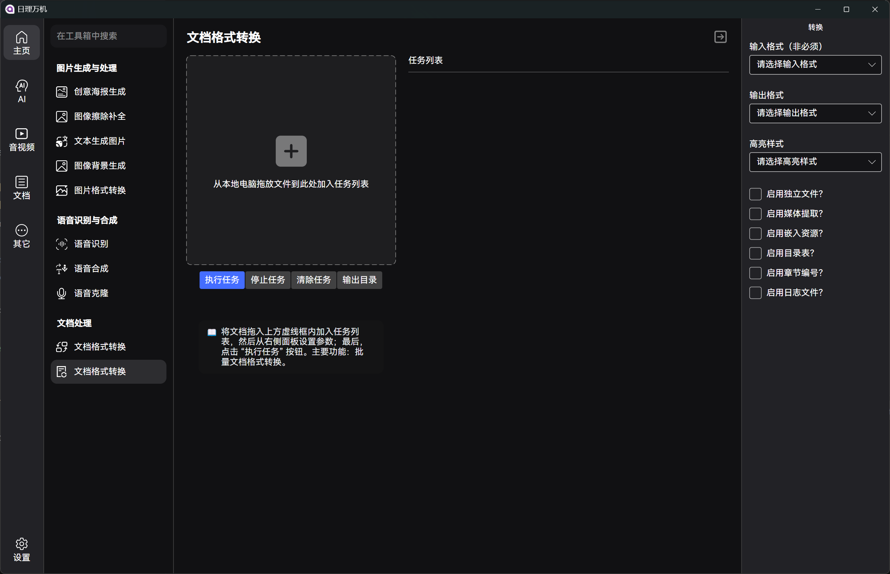

# [“日理万机” 工具箱](https://gitee.com/xkpro/bee) 文档处理插件

插件功能基于 `pandoc` 命令行工具封装，与 `pandoc` 的输入、输出格式一致！

输入格式：

```plaintext
biblatex, bibtex, bits, commonmark, commonmark_x, creole, csljson, csv, djot, docbook, docx, dokuwiki, endnotexml, epub, fb2, gfm, haddock, html, ipynb, jats, jira, json, latex, man, markdown, markdown_github, markdown_mmd, markdown_phpextra, markdown_strict, mdoc, mediawiki, muse, native, odt, opml, org, ris, rst, rtf, t2t, textile, tikiwiki, tsv, twiki, typst, vimwiki
```

输出格式：

```plaintext
ansi, asciidoc, asciidoc_legacy, asciidoctor, beamer, biblatex, bibtex, chunkedhtml, commonmark, commonmark_x, context, csljson, djot, docbook, docbook4, docbook5, docx, dokuwiki, dzslides, epub, epub2, epub3, fb2, gfm, haddock, html, html4, html5, icml, ipynb, jats, jats_archiving, jats_articleauthoring, jats_publishing, jira, json, latex, man, markdown, markdown_github, markdown_mmd, markdown_phpextra, markdown_strict, markua, mediawiki, ms, muse, native, odt, opendocument, opml, org, pdf, plain, pptx, revealjs, rst, rtf, s5, slideous, slidy, tei, texinfo, textile, typst, xwiki, zimwiki
```



## 插件功能


## 使用方法

将插件解包后放置在主程序 `Plugins` 根目录下